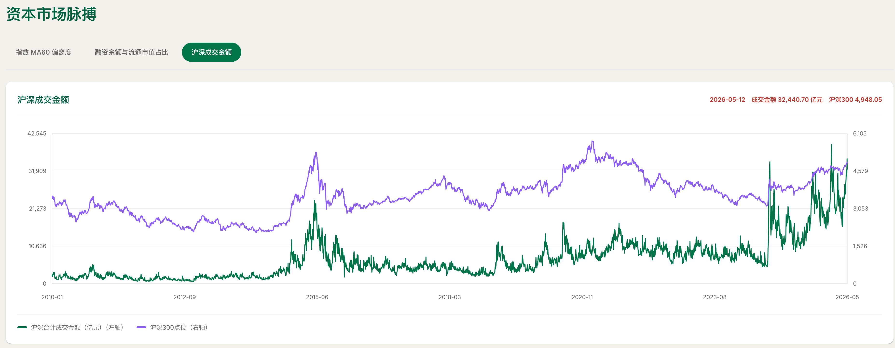
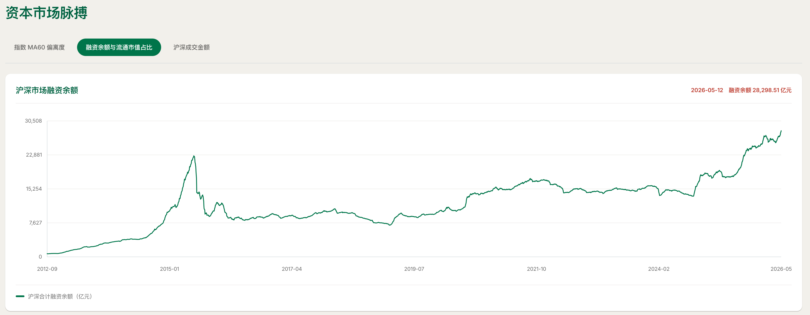
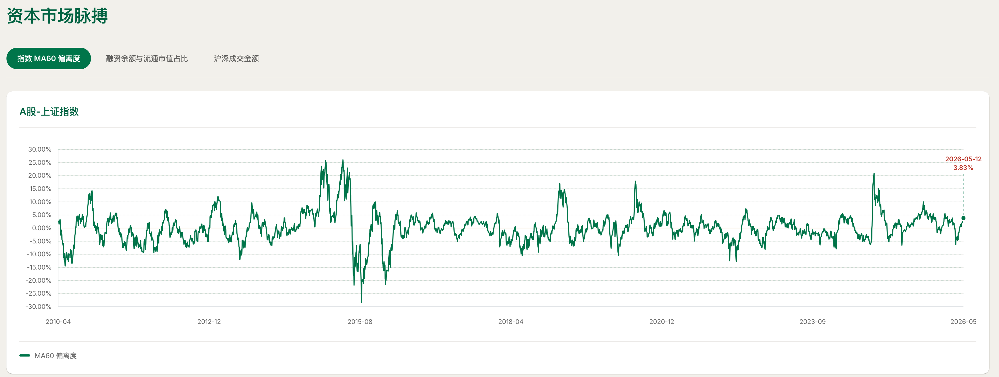
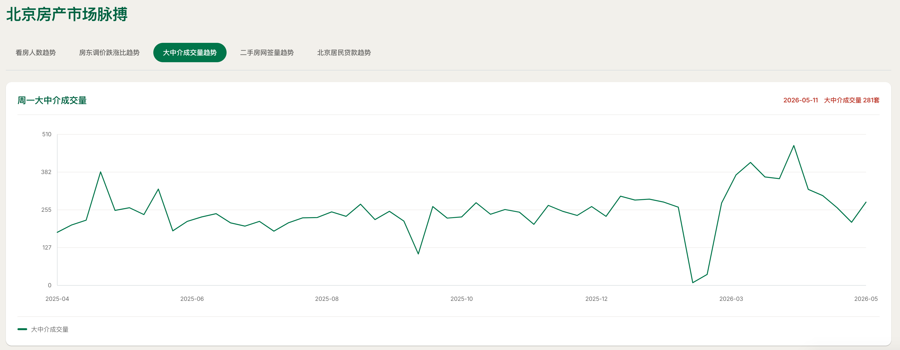
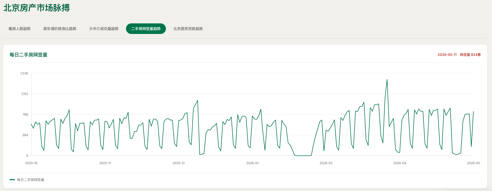
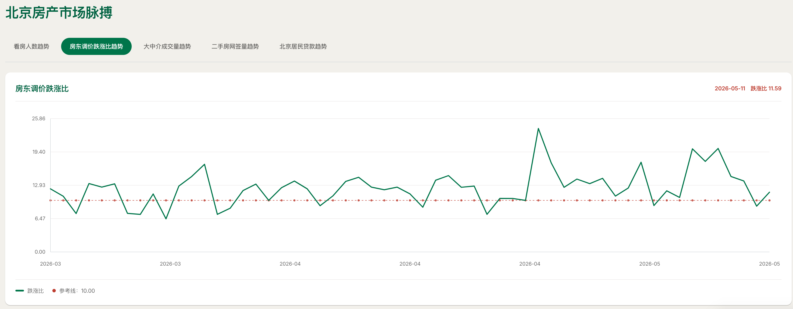
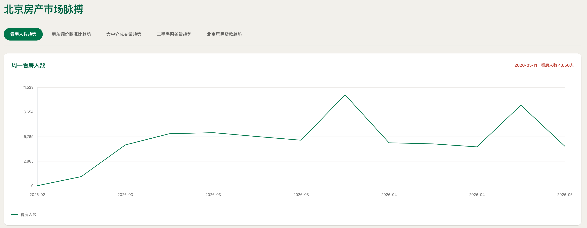
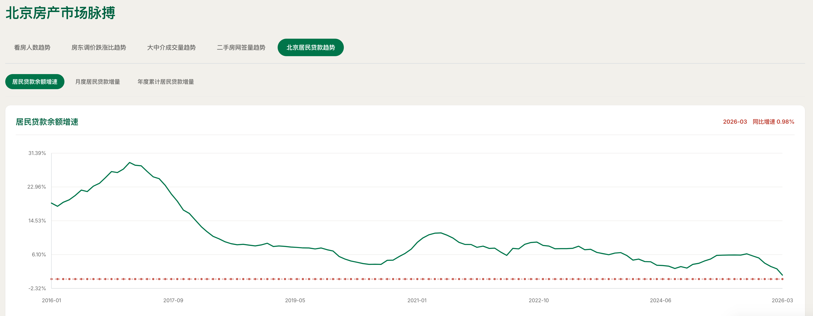

# MarketPulse

`MarketPulse` 是一个本地数据更新、静态网页生成和微信小程序展示仓库，主要做三件事：

1. 汇总并展示 A 股市场脉搏数据，包括沪深两市成交金额、融资余额、沪深 300 点位等；
2. 汇总并展示北京房产市场脉搏数据，包括成交、挂牌、看房、信贷等指标；
3. 复用相同 payload，通过微信云函数按 section 向原生小程序提供只读看板。

现有 Python 脚本和 HTML 输出仍是业务数据基线。小程序链路不会重写指标，也不会改变原有 HTML 模板、输出路径或生成行为。

## 仓库内容

- `src/security_market_pulse.py`：A 股市场脉搏数据更新与页面生成脚本
- `src/beijing_real_estate_market_pulse.py`：北京房产市场脉搏页面生成脚本
- `src/market_daily_info.py`：A 股相关数据抓取与清洗工具
- `config/consts.py`：全局配置
- `config/index_code.py`：指数代码配置
- `api/upload_payload.py`：生成、暂存并可选上传小程序 payload
- `api/cloudfunctions/getDashboardSection/`：按白名单 section 返回数据的微信云函数
- `miniprogram/`：微信原生小程序
- `docs/delivery-guide.md`：上传、部署、调试、预览和交付说明
- `docs/payload-field-contract.md`：网页与小程序共享的 payload 字段契约
- `tests/`：单元测试
- `memory-bank/design-document.md`：小程序产品设计说明

## 运行前准备

建议使用独立虚拟环境，然后安装依赖：

```bash
pip install pandas akshare requests openpyxl tushare pytest
```

如果你的环境里已经有项目依赖，可以按现有方式安装，不必重复。

## 环境变量

仓库支持通过 `.env` 读取环境变量。

- `.env.example`：示例文件，请将其重命名为.env，并填写其中的配置

当前已知需要的变量：

- `TUSHARE_TOKEN`：用于 Tushare 数据源；没有这个值时，脚本会退回到备选数据源

## 使用方式

### A 股市场脉搏

默认执行：

```bash
python3 src/security_market_pulse.py
```

常用参数：

```bash
python3 src/security_market_pulse.py --start-date 2010-01-01
python3 src/security_market_pulse.py --db-path data/market_data.sqlite
python3 src/security_market_pulse.py --output-dir pics
python3 src/security_market_pulse.py --skip-fetch
```

这个脚本会先更新本地数据库，再生成交互式 HTML 页面。

### 北京房产市场脉搏

默认执行：

```bash
python3 src/beijing_real_estate_market_pulse.py
```

常用参数：

```bash
python3 src/beijing_real_estate_market_pulse.py --start-date 2020-01-01
python3 src/beijing_real_estate_market_pulse.py --db-path data/market_data.sqlite
python3 src/beijing_real_estate_market_pulse.py --output-dir beijing_real_estate_market_pulse
```

这个脚本只读取数据库并生成页面，不负责抓取外部数据。

## 预期产出

### A 股脚本输出

- SQLite 数据库：`data/market_data.sqlite`
- 交互式页面：默认输出到 `security_market_pulse/index.html`，也可以用 `--output-dir` 覆盖

页面内容包含：

- 沪深两市合计成交金额
- 沪深 300 点位
- 融资余额相关图表
- 指数偏离度图表

### 北京房产脚本输出

- 交互式页面：默认输出到 `beijing_real_estate_market_pulse/index.html`

页面内容包含：

- 房产成交与看房指标
- 挂牌涨跌结构
- 居民信贷相关图表

## 结果示例

### A 股市场脉搏







### 北京房产市场脉搏











## 测试

```bash
python3 -m pytest
```

## 微信小程序交付

完整流程见 [docs/delivery-guide.md](docs/delivery-guide.md)，包括：

- 从 SQLite 生成 payload 和 manifest；
- 上传到非公开微信云存储；
- 部署 `getDashboardSection`；
- 配置测试账号和测试云环境；
- 微信开发者工具调试、云函数调用和真机预览；
- 安全检查、验收清单和已知限制。

快速本地生成：

```bash
python3 api/upload_payload.py \
  --db-path data/market_data.sqlite \
  --start-date 2010-01-01
```

生成的完整 payload 位于忽略目录 `api/payload/`，不得提交或公开。
